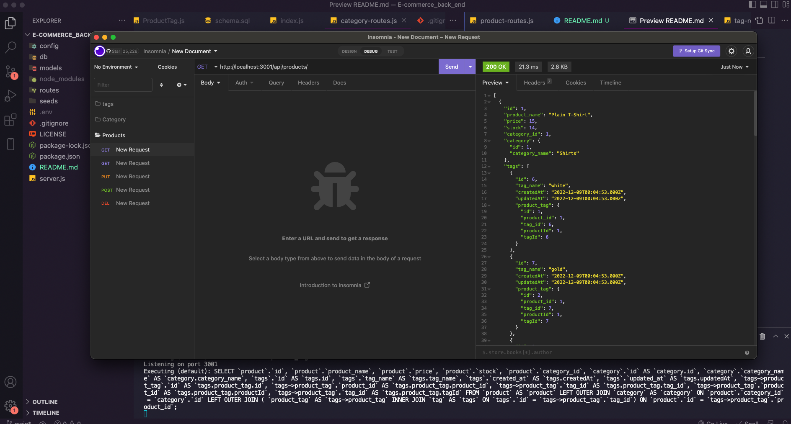

# e-commerce-back-end

## Table of contents

### [Description](#description)

### [Installation](#installation)

### [Credits](#credits)

### [Media](#media)

### [License](#license)

### [Questions](#questions)

## Description

This the backend of an E-commerce-site using express and sequelize

## Installation

clone the code, don't an npm i, npm run seed then npm start

## Media

video
https://www.youtube.com/watch?v=_eF87Evjx2E&ab_channel=JacksonGrimm

## Credits

JacksonGrimm
https://github.com/JacksonGrimm

## License

MIT License

## Questions

if you have any questions got to me github profile to contact me
https://github.com/JacksonGrimm
